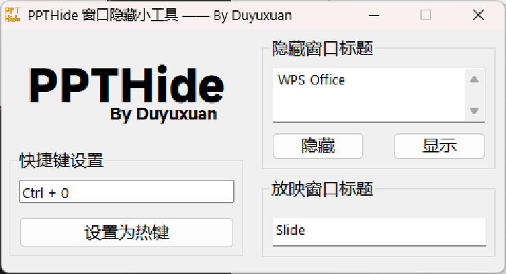

# PPTHide 窗口隐藏小工具

PPTHide 辅助录制、演示的窗口隐藏小工具

<!-- PROJECT SHIELDS -->


<!-- PROJECT LOGO -->
<br />

<p align="center">
  <a href="https://github.com/du-yuxuan/PPTHide">
    
  </a>

  <h3 align="center">PPTHide</h3>
  <p align="center">
    辅助录制、演示的窗口隐藏小工具
    <br />
    体积小 仅432KB · 界面简洁 无广告 · 使用方便 托盘图标+快捷键 
    <br />
    <br />
    <a href="https://github.com/du-yuxuan/PPTHide"><strong>探索本项目 »</strong></a>
    <br />
    <a href="https://github.com/du-yuxuan/PPTHide">查看项目</a>
    ·
    <a href="https://github.com/du-yuxuan/PPTHide/issues">报告Bug/提出新特性</a>
    ·
    <a href="https://github.com/du-yuxuan/PPTHide/releases">下载可执行文件</a>
  </p>

</p>

## 目录

- [上手指南](#上手指南)
  - [界面展示](#界面展示)
  - [隐藏窗口标题](#隐藏窗口标题)
  - [快捷键设置、放映窗口标题](#快捷键设置、放映窗口标题)
  - [使用教程](#使用教程)
- [文件目录说明](#文件目录说明)
- [开发的架构](#开发的架构)
- [版本控制](#版本控制)
- [作者](#作者)
- [鸣谢](#鸣谢)

### 上手指南


1. 到https://github.com/du-yuxuan/PPTHide/releases下载可执行文件
2. 打开运行

**温馨提示：**

- **点击最小化会挂起到托盘，点击托盘图标重新显示主窗口**

- **为了数据安全，软件不会保存输入，需要每次打开软件重新输入！**

#### 界面展示

1. 隐藏窗口标题
2. 快捷键设置
3. 放映窗口标题



#### 隐藏窗口标题

1. 输入需要隐藏窗口的标题（如WPS Office）不需要一模一样，模糊匹配的,每行一个
2. 点击隐藏，所有窗口被隐藏
3. 使用完成之后注意点击显示，退出本软件并不会自动结束隐藏，要是已经退出了本软件重启就一切恢复正常了

#### 快捷键设置、放映窗口标题

1. 点击热键输入框
2. 输入需要设置的热键（如Ctrl+0）
3. 点击设置热键
4. 输入放映窗口标题不同软件不同，作者用的WPS标题里面含有Slide，故输入Slide（注意大小写）

#### 使用教程

1. 放映PPT
2. Alt+Tab切换到本软件
3. 隐藏WPS Office，切回放映
4. 开始录制、演示
5. 需要切出PPT时就点击设置的快捷键，会自动隐藏放映
6. 完成演示后，再按一次快捷键，会重新显示放映，这时需要滑动鼠标，刷新窗口，才会显示出来。

### 文件目录说明
```
|
│  README.md
│  
├─0Code
│  │  main.aardio
│  │  ppthide.aproj
│  │  
│  ├─.build
│  │      
│  ├─dist
│  │      PPTHide.exe
│  │      
│  ├─lib
│  │      
│  └─res
├─1Resource
│  │  logo.png
│  │  logo.psd
│  │  
│  └─logo
│          logo.gif
│          logo.jpg
│          logoico_0000~9.ico
│          logolarge.png
│          logo_0000~9.png
│          
└─2Docs
    │  PPTHide介绍.pptx
    │  PPTHide使用文档.pdf
    │  
    └─PPTHide使用文档

```

### 开发的架构 

使用[桌面软件快速开发工具-aardio](https://aardio.com/)开发

### 版本控制

该项目使用Git进行版本管理。您可以在repository参看当前可用版本。

### 作者

Duyuxuan@[du-yuxuan](https://github.com/du-yuxuan)

知乎：[duyuxuan](https://www.zhihu.com/people/duyuxuan-2)

哔哩哔哩Bilibili：[Dyyyyyxxxxx](https://space.bilibili.com/2100193886?spm_id_from=333.1007.0.02)

### 版权说明

该项目签署了MIT 授权许可，详情请参阅 [LICENSE](https://github.com/du-yuxuan/PPTHide/blob/master/LICENSE)

### 鸣谢


- [桌面软件快速开发工具-aardio](https://aardio.com/)
